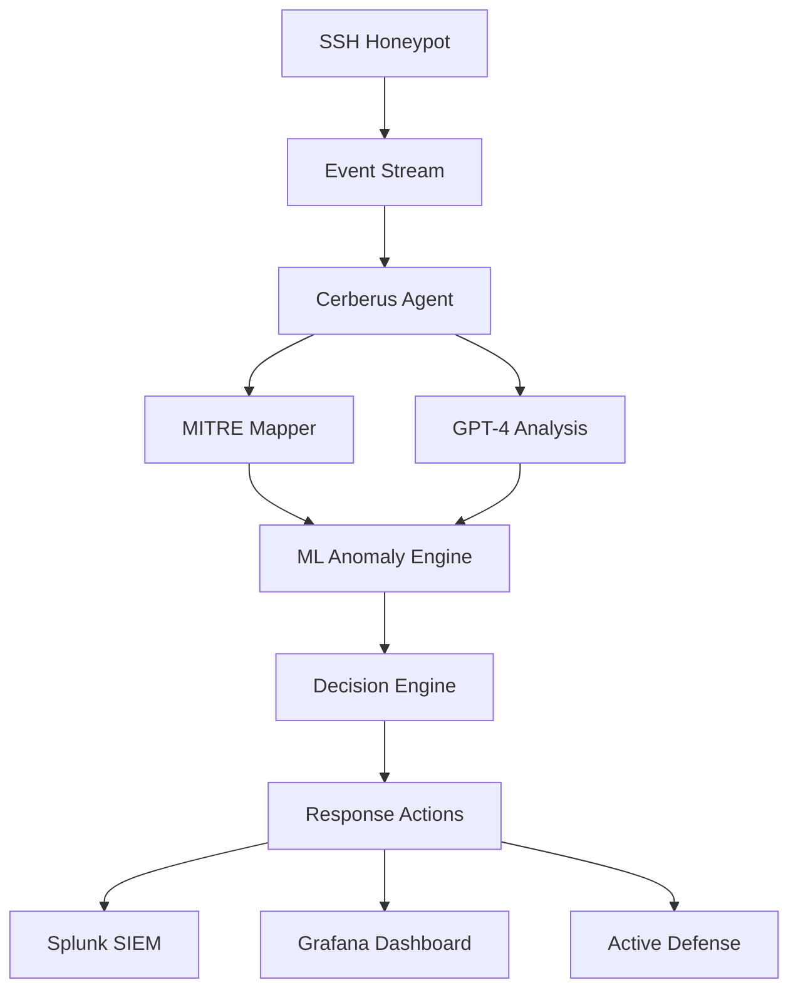

# Component Deep Dive

## 🍯 Deception Layer - The Honey Trap

### SSH Honeypot (Cowrie)

- **File**: `agent/cerberus_agent.py`
- **Purpose**: Simulates vulnerable SSH servers
- **Key Features**:
  - Real-time session capture
  - Command logging and analysis
  - File interaction simulation
  - Network service emulation

```python
# Key code snippet from my implementation
class HoneypotEvent:
    def __init__(self, session_id, source_ip, command, timestamp):
        self.session_id = session_id
        self.source_ip = source_ip
        self.command = command
        self.timestamp = timestamp
        self.mitre_techniques = []
```

### Fake Admin Panels
- **Technology**: Custom Python/Flask applications
- **Purpose**: Lure attackers seeking administrative access
- **Deception Elements**:
  - Realistic login forms
  - Fake database credentials
  - Decoy configuration files

### Vulnerable Database Simulations
- **Implementation**: SQLite with fake data
- **Purpose**: Attract data exfiltration attempts
- **Features**:
  - Synthetic customer records
  - Fake financial information
  - Hidden tracking beacons

## 🎭 AI Engagement System - The Puppet Master

### GPT-4 Personas
- **File**: `traps/chatbot.py`
- **Purpose**: Keep attackers engaged through conversation
- **Character Roster**:
  - "Worried Junior Admin" - Panics about security
  - "Helpful IT Support" - Overshares information
  - "Panicked Intern" - Makes "mistakes" that help attackers
  - "Overworked DBA" - Complains about security policies

```python
# From traps/chatbot.py
class PersonaEngine:
    def __init__(self, openai_api_key):
        self.client = OpenAI(api_key=openai_api_key)
        self.personas = {
            "junior_admin": "You are a worried junior system administrator...",
            "helpful_support": "You are an overly helpful IT support person...",
            "panicked_intern": "You are a panicked intern who makes mistakes..."
        }
    
    def generate_response(self, persona, attacker_input, session_context):
        # Generate contextual AI response
        pass
```

### Behavioral Analysis Engine
- **File**: `ml/anomaly.py`
- **Purpose**: Learn from attacker behaviors
- **Techniques**:
  - Command pattern recognition
  - Timing analysis
  - Tool fingerprinting
  - Session flow mapping

## 🧠 Detection & Intelligence - The All-Seeing Eye

### ML Anomaly Engine
- **File**: `ml/anomaly.py`
- **Algorithm**: Isolation Forest with custom features
- **Key Features**:
  - Real-time anomaly scoring
  - Behavioral baseline establishment
  - Pattern clustering
  - Confidence thresholds

```python
# From ml/anomaly.py
from sklearn.ensemble import IsolationForest

class AnomalyDetector:
    def __init__(self):
        self.model = IsolationForest(contamination=0.1, random_state=42)
        self.feature_extractor = FeatureExtractor()
    
    def analyze_events(self, events):
        features = self.feature_extractor.extract(events)
        scores = self.model.decision_function(features)
        return self._interpret_scores(scores)
```

### MITRE ATT&CK Mapper
- **File**: `shared/mitre_mapper.py`
- **Purpose**: Map attacks to standardized framework
- **Implementation**:
  - Rule-based pattern matching
  - Technique confidence scoring
  - Tactic classification
  - Kill chain progression tracking

```python
# From shared/mitre_mapper.py
class MitreMapper:
    def __init__(self):
        self.technique_patterns = {
            "T1110": ["brute.*force", "password.*spray"],
            "T1021.004": ["ssh.*login", "ssh.*connect"],
            "T1083": ["ls", "dir", "find", "locate"]
        }
    
    def map_event(self, event):
        techniques = []
        for technique_id, patterns in self.technique_patterns.items():
            if self._matches_patterns(event.command, patterns):
                techniques.append({
                    "technique_id": technique_id,
                    "confidence": self._calculate_confidence(event)
                })
        return techniques
```

### Threat Intelligence Generator
- **Purpose**: Create actionable intelligence from attacks
- **Outputs**:
  - IOCs (Indicators of Compromise)
  - YARA rules
  - Snort signatures
  - STIX/TAXII feeds

## 🤖 Autonomous Response - The Enforcer

### Cerberus Agent
- **File**: `agent/cerberus_agent.py`
- **Purpose**: Make autonomous defensive decisions
- **Decision Types**:
  - `monitor` - Enhanced logging
  - `rotate_key` - SSH key rotation
  - `launch_decoy` - Deploy additional honeypots
  - `insert_trap` - Add deceptive content
  - `escalate` - Alert security teams

```python
# From agent/cerberus_agent.py
class CerberusAgent:
    def __init__(self, config):
        self.threshold = config.get('threshold', 0.7)
        self.auto_action = config.get('auto_action', True)
        self.gpt_client = OpenAI(api_key=config.get('openai_api_key'))
    
    async def analyze_and_respond(self, event):
        # 1. Enrich with MITRE techniques
        enriched_event = self.mitre_mapper.map_event(event)
        
        # 2. Get AI assessment
        ai_analysis = await self._get_ai_analysis(enriched_event)
        
        # 3. Make decision
        decision = self._make_decision(ai_analysis)
        
        # 4. Execute if above threshold
        if decision.confidence >= self.threshold and self.auto_action:
            await self._execute_response(decision)
```

### Active Defense Engine
- **Purpose**: Execute countermeasures
- **Capabilities**:
  - Key rotation
  - Decoy deployment
  - Attribution beacon injection
  - Traffic redirection

### Attribution Engine
- **Purpose**: Profile and track attackers
- **Features**:
  - Tool fingerprinting
  - Behavioral clustering
  - Infrastructure mapping
  - Campaign correlation

## 🏢 Enterprise Integration - The Command Center

### Splunk Integration
- **File**: `integrations/splunk_integration.py`
- **Purpose**: Feed data to enterprise SIEM
- **Implementation**:
  - HTTP Event Collector (HEC)
  - Real-time event streaming
  - Custom field mapping
  - Alert generation

```python
# From integrations/splunk_integration.py
class SplunkIntegration:
    def __init__(self, hec_url, hec_token):
        self.hec_url = hec_url
        self.hec_token = hec_token
        self.session = requests.Session()
    
    def send_event(self, event_data):
        payload = {
            "time": event_data.timestamp,
            "source": "cerberusmesh",
            "sourcetype": "honeypot:attack",
            "event": event_data.to_dict()
        }
        return self._send_to_splunk(payload)
```

### Grafana Dashboards
- **Purpose**: Real-time visualization
- **Dashboards**:
  - Attack timeline
  - Geographic distribution
  - Technique frequency
  - System health

### Incident Response Integration
- **Purpose**: Trigger security workflows
- **Integration Points**:
  - ServiceNow tickets
  - PagerDuty alerts
  - Slack notifications
  - Email reports

## 🔧 Technology Stack

### Core Technologies
- **Python 3.11+**: Primary development language
- **FastAPI**: REST API framework
- **Redis**: Caching and message queuing
- **Docker**: Containerization
- **SQLite/PostgreSQL**: Data persistence

### AI/ML Stack
- **OpenAI GPT-4**: Natural language processing
- **scikit-learn**: Machine learning algorithms
- **pandas/numpy**: Data processing
- **MITRE ATT&CK**: Threat framework

### Infrastructure
- **AWS**: Cloud deployment platform
- **Terraform**: Infrastructure as Code
- **Grafana**: Metrics and dashboards
- **Prometheus**: Monitoring and alerting

## 🔗 Component Relationships



---

## 📚 Related Notes

- [[System Overview]] - High-level architecture
- [[Data Flow Analysis]] - How data moves through components
- [[Demo Scenarios]] - How to demonstrate each component
- [[Technical Questions]] - Interview questions about components

---
*Tags: #components #technical #implementation #honeypot #ai*
