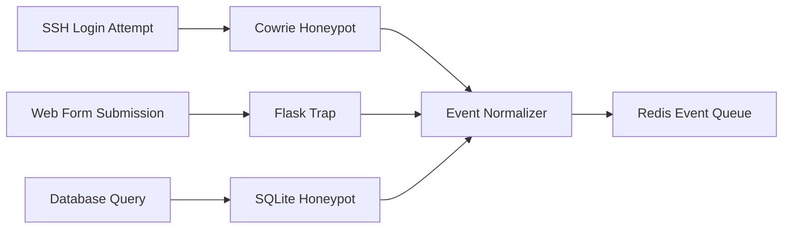
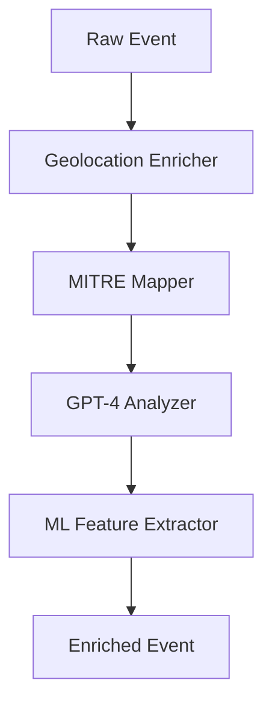
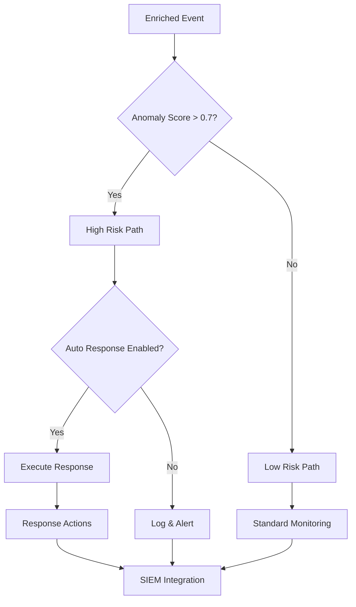
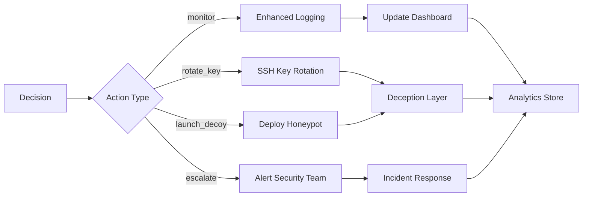
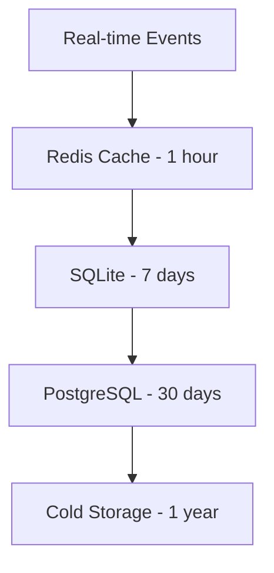
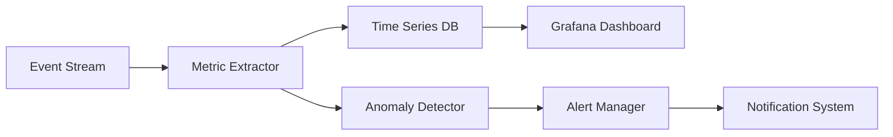

# Data Flow Analysis

## 🔄 Event Pipeline - From Honey to Intelligence

### Stage 1: Event Collection


#### Raw Event Structure
```json
{
  "timestamp": "2024-01-15T14:30:22Z",
  "source_ip": "192.168.1.100",
  "session_id": "ssh_session_001",
  "honeypot_type": "ssh",
  "event_type": "login_attempt",
  "data": {
    "username": "admin",
    "password": "password123",
    "command": null,
    "user_agent": null
  },
  "geolocation": {
    "country": "Unknown",
    "city": "Unknown",
    "asn": "Unknown"
  }
}
```

### Stage 2: Event Enrichment


#### Enriched Event Structure
```json
{
  "original_event": { /* Raw event data */ },
  "enrichment": {
    "geolocation": {
      "country": "Russia",
      "city": "Moscow",
      "asn": "AS12345 Example ISP",
      "is_vpn": true,
      "is_tor": false
    },
    "mitre_techniques": [
      {
        "technique_id": "T1110.001",
        "technique_name": "Password Spraying",
        "confidence": 0.85,
        "tactic": "Credential Access"
      }
    ],
    "gpt_analysis": {
      "threat_level": "medium",
      "behavior_summary": "Automated password spraying attempt",
      "recommended_action": "monitor",
      "persona_response": "worried_admin"
    },
    "ml_features": {
      "login_frequency": 15.2,
      "inter_request_time": 0.5,
      "credential_entropy": 2.1,
      "anomaly_score": 0.73
    }
  }
}
```

### Stage 3: Decision Engine


#### Decision Tree Logic
```python
# From agent/cerberus_agent.py
def make_decision(self, enriched_event):
    score = enriched_event['enrichment']['ml_features']['anomaly_score']
    techniques = enriched_event['enrichment']['mitre_techniques']
    
    # Score-based thresholds
    if score >= 0.9:
        return Decision(action="escalate", confidence=0.95)
    elif score >= 0.7:
        return Decision(action="launch_decoy", confidence=0.8)
    elif score >= 0.5:
        return Decision(action="rotate_key", confidence=0.6)
    else:
        return Decision(action="monitor", confidence=0.3)
```

### Stage 4: Response Execution


## 🔄 Real-Time Processing

### Event Throughput
- **Peak Capacity**: 10,000 events/minute
- **Processing Latency**: < 500ms per event
- **Storage**: Rolling 30-day retention
- **Alerting**: Sub-second critical alerts

### Data Retention Strategy


## 🎯 Data Quality & Validation

### Event Validation Pipeline
1. **Schema Validation**: JSON schema compliance
2. **IP Validation**: RFC compliance, GeoIP lookup
3. **Timing Validation**: Chronological ordering
4. **Content Validation**: Command sanitization
5. **Deduplication**: Hash-based duplicate detection

### Quality Metrics
- **Event Loss Rate**: < 0.1%
- **False Positive Rate**: < 5%
- **Processing Accuracy**: > 99%
- **Data Integrity**: 100% (checksums)

## 🔐 Security & Privacy

### Data Protection
- **Encryption**: AES-256 at rest, TLS 1.3 in transit
- **Anonymization**: IP masking for non-critical events
- **Access Control**: Role-based permissions
- **Audit Trail**: All data access logged

### Compliance Considerations
- **PII Handling**: Automatic detection and masking
- **Data Sovereignty**: Regional storage options
- **Retention Policies**: Configurable cleanup
- **Export Controls**: ITAR/EAR compliance

## 📊 Analytics Flow

### Metrics Collection


### Key Performance Indicators
- **Attack Volume**: Events per hour/day
- **Technique Distribution**: MITRE frequency
- **Geographic Patterns**: Source country trends
- **Response Effectiveness**: Action success rates

## 🔄 Integration Points

### Inbound Data Sources
- **Honeypot Events**: SSH, Web, Database
- **Network Telemetry**: Firewall logs, NetFlow
- **Threat Intelligence**: IOC feeds, YARA rules
- **Security Tools**: Nessus scans, vulnerability data

### Outbound Data Consumers
- **SIEM Platforms**: Splunk, QRadar, Sentinel
- **Orchestration**: SOAR platforms, playbooks
- **Dashboards**: Grafana, Kibana, custom UIs
- **APIs**: RESTful endpoints for integration

---

## 📚 Related Notes

- [[Component Deep Dive]] - Technical implementation details
- [[System Overview]] - High-level architecture
- [[Performance Tuning]] - Optimization strategies
- [[Troubleshooting]] - Common issues and solutions

---
*Tags: #dataflow #architecture #pipeline #realtime #analytics*
