# Demo Scenarios

## 🎬 Live Demonstration Playbook

### Scenario 1: SSH Brute Force Attack

**Demo Duration**: 5 minutes  
**Audience**: Technical interview, security team  
**Key Learning**: Real-time detection and AI response

#### Setup
1. Start CerberusMesh dashboard: `http://localhost:8000`
2. Open Grafana monitoring: `http://localhost:3000`
3. Prepare attack script: `demo_scripts/ssh_bruteforce.py`

#### The Attack
```bash
# Simulated attacker commands
python demo_scripts/ssh_bruteforce.py --target honeypot.local --wordlist common_passwords.txt
```

#### What Happens (Narrate This)
1. **Event Detection**: "Watch the dashboard - we're seeing login attempts in real-time"
2. **MITRE Mapping**: "The system immediately maps this to T1110.001 - Password Spraying"
3. **AI Analysis**: "GPT-4 analyzes the pattern and recommends escalation"
4. **Autonomous Response**: "Cerberus automatically deploys a decoy honeypot"
5. **Intelligence Generation**: "We're now generating IOCs for this attack pattern"

#### Key Talking Points
- **Real-time Processing**: "Sub-second detection and analysis"
- **AI Integration**: "GPT-4 provides human-like threat assessment"
- **Autonomous Action**: "No human intervention required for common attacks"
- **Enterprise Integration**: "All data flows to Splunk for investigation"

### Scenario 2: Social Engineering with AI

**Demo Duration**: 8 minutes  
**Audience**: Executive leadership, sales prospects  
**Key Learning**: AI-powered attacker engagement

#### Setup
1. Open chatbot interface: `http://localhost:8000/chat`
2. Prepare personas: Junior Admin, Helpful Support, Panicked Intern
3. Start screen recording for replay

#### The Attack Simulation
```bash
# Attacker tries to social engineer information
curl -X POST http://localhost:8000/chat \
  -H "Content-Type: application/json" \
  -d '{"message": "Hey, I forgot my password again. Can you help me reset it?"}'
```

#### AI Persona Responses (Live Demo)

**Junior Admin Persona**:
> "Oh no, another password reset? You're the third person this week! I'm still new here and don't want to get in trouble. Maybe I should ask my supervisor... but she's in a meeting. Can you tell me your employee ID? I think I can help if you're in the system."

**Helpful Support Persona**:
> "Sure! I love helping people with password issues. While I reset it, let me tell you about our new systems. We just migrated everything to the new AWS environment. The old Oracle database had so many security issues, but now everything's on the cloud! What department are you in again?"

**Panicked Intern Persona**:
> "OMG yes! I've been messing up password resets all day. My supervisor is going to kill me if I break something else. Wait, are you supposed to use the secure password tool? I think there's a command for it... let me check my notes... oh wait, I probably shouldn't share that. But between you and me, most people just use 'CompanyName2024!'"

#### What Makes This Powerful
- **Psychological Manipulation**: Each persona uses different social engineering vectors
- **Information Disclosure**: AI "accidentally" reveals useful information
- **Persistence**: Keeps attackers engaged for maximum intelligence gathering
- **Learning**: System learns attacker techniques for future defense

### Scenario 3: Database Attack with ML Detection

**Demo Duration**: 6 minutes  
**Audience**: Data security teams, compliance officers  
**Key Learning**: Advanced ML anomaly detection

#### Setup
1. Connect to honeypot database: `sqlite3 honeypot_db.sqlite`
2. Monitor ML dashboard: `http://localhost:8000/ml-metrics`
3. Prepare SQL injection payloads

#### The Attack
```sql
-- Normal queries (establish baseline)
SELECT * FROM users WHERE username = 'john.doe';
SELECT * FROM products WHERE category = 'electronics';

-- Malicious queries (trigger anomalies)
SELECT * FROM users WHERE 1=1 UNION SELECT password FROM admin_users;--
SELECT * FROM credit_cards WHERE '1'='1';
```

#### ML Detection in Action
1. **Baseline Learning**: First few queries establish normal patterns
2. **Anomaly Detection**: ML algorithm detects statistical outliers
3. **Feature Analysis**: Query complexity, timing, result set size
4. **Confidence Scoring**: 0.92 confidence on SQL injection attempt
5. **Automated Response**: Database honeypot locks down, deploys additional monitors

#### Technical Deep Dive
```python
# Show this code during demo
class SQLAnomalyDetector:
    def analyze_query(self, query):
        features = {
            'query_length': len(query),
            'keyword_count': self.count_sql_keywords(query),
            'special_chars': self.count_special_chars(query),
            'union_count': query.lower().count('union'),
            'comment_count': query.count('--') + query.count('/*')
        }
        return self.model.predict_proba([list(features.values())])[0][1]
```

### Scenario 4: Full Kill Chain Demonstration

**Demo Duration**: 12 minutes  
**Audience**: Technical executives, security architects  
**Key Learning**: End-to-end attack lifecycle

#### Multi-Stage Attack Flow
1. **Reconnaissance**: Port scans detected and honey-trapped
2. **Initial Access**: SSH brute force with AI engagement
3. **Persistence**: Backdoor installation in honeypot environment
4. **Privilege Escalation**: Sudo exploitation attempts
5. **Lateral Movement**: Network discovery and additional compromises
6. **Data Exfiltration**: Database queries and file access
7. **Command & Control**: Beacon establishment

#### CerberusMesh Response Timeline

```mermaid
gantt
    title Attack vs Defense Timeline
    dateFormat X
    axisFormat %M:%S
    
    section Attack
    Reconnaissance    :a1, 0, 60
    Initial Access    :a2, 60, 120
    Persistence       :a3, 120, 180
    Privilege Esc     :a4, 180, 240
    Lateral Movement  :a5, 240, 360
    Data Exfiltration :a6, 360, 480
    C2 Establishment  :a7, 480, 600
    
    section Defense
    Detection         :d1, 15, 75
    Analysis          :d2, 75, 135
    Response          :d3, 135, 195
    Containment       :d4, 195, 255
    Intelligence      :d5, 255, 375
    Attribution       :d6, 375, 495
    Reporting         :d7, 495, 615
```


#### Intelligence Products Generated
- **IOCs**: 47 indicators extracted automatically
- **YARA Rules**: 3 custom rules for attacker tools
- **TTPs**: Complete MITRE ATT&CK mapping
- **Attribution**: Behavioral clustering with previous attacks

## 🎯 Audience-Specific Talking Points

### For Technical Interviews
- **Architecture Decisions**: Why FastAPI over Django? Redis vs. PostgreSQL?
- **Scalability**: How does it handle 10,000 events/minute?
- **Security**: What prevents attackers from detecting the honeypot?
- **ML Implementation**: Feature engineering choices and model selection

### For Business Stakeholders
- **ROI**: Cost of prevention vs. cost of breach
- **Time to Value**: Deployment in hours, value in days
- **Risk Reduction**: Quantified threat detection improvement
- **Compliance**: NIST, ISO 27001, SOC 2 alignment

### For Security Teams
- **Integration**: How it fits into existing SOC workflows
- **Customization**: Adapting honeypots to specific environments
- **Response**: Automated vs. manual response capabilities
- **Intelligence**: Threat hunting and proactive defense

## 📱 Demo Environment Requirements

### Hardware Specifications
- **Minimum**: 8GB RAM, 4 CPU cores, 50GB storage
- **Recommended**: 16GB RAM, 8 CPU cores, 100GB storage
- **Network**: Internet access for AI APIs and threat feeds

### Software Dependencies
- **Docker & Docker Compose**: Latest stable versions
- **Python 3.11+**: With pip and virtual environment
- **Browser**: Chrome/Firefox for dashboard access
- **Terminal**: PowerShell, bash, or zsh

### Pre-Demo Checklist
- [ ] All containers running and healthy
- [ ] API endpoints responding (200 status)
- [ ] Grafana dashboards loading
- [ ] Demo scripts tested and working
- [ ] Backup data in case of failures
- [ ] Screen recording setup (optional)

## 🔧 Troubleshooting Common Demo Issues

### Container Won't Start
```bash
# Check logs
docker-compose logs cerberus-api

# Common fixes
docker-compose down
docker system prune -f
docker-compose up --build
```

### API Returns 500 Errors
```bash
# Check environment variables
cat .env | grep -v "^#"

# Verify Redis connection
docker exec -it cerberusmesh-redis redis-cli ping
```

### GPT-4 Not Responding
```bash
# Test API key
curl -H "Authorization: Bearer $OPENAI_API_KEY" \
     https://api.openai.com/v1/models
```

### Dashboard Shows No Data
```bash
# Force event generation
python demo_scripts/generate_sample_events.py --count 100
```

---

## 📚 Related Notes

- [[System Overview]] - Understanding the architecture
- [[Component Deep Dive]] - Technical implementation details
- [[Interview Preparation]] - Technical questions and answers
- [[Troubleshooting]] - Common issues and solutions

---
*Tags: #demo #presentation #scenarios #troubleshooting #interview*
