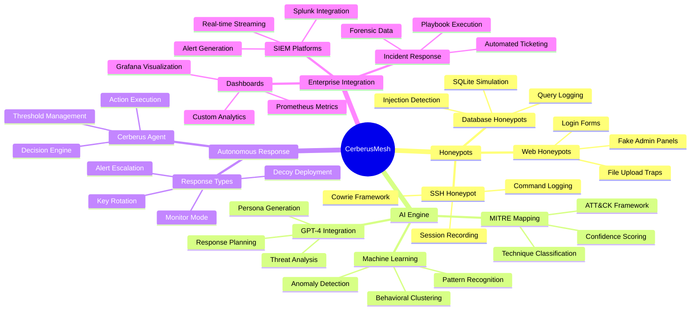
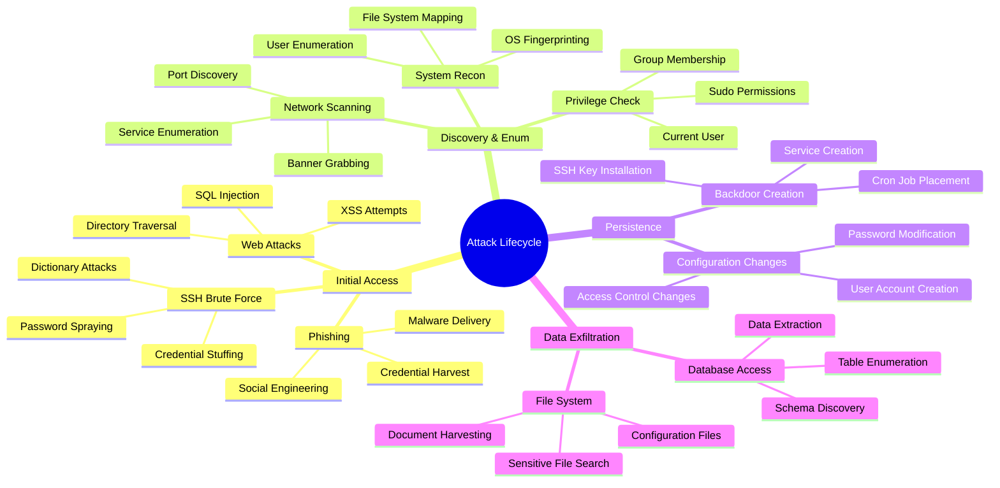
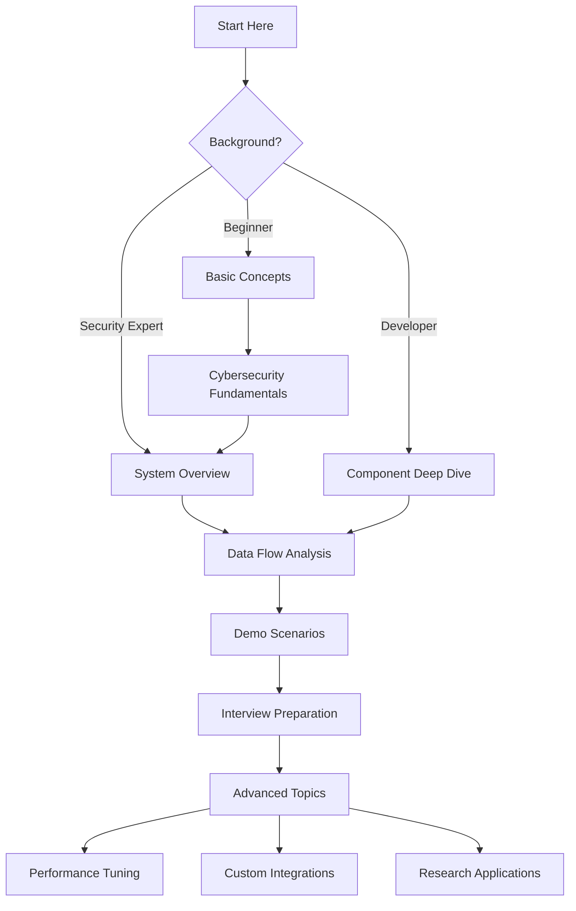
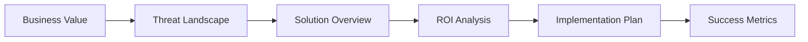
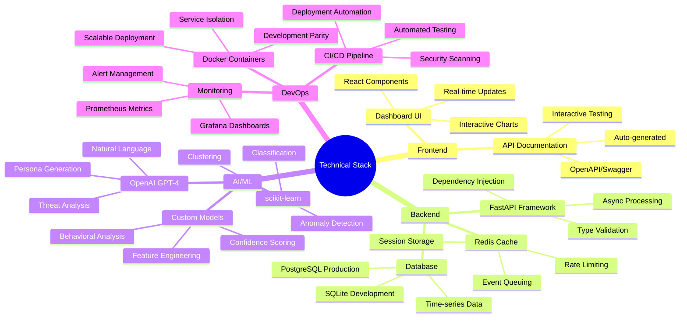
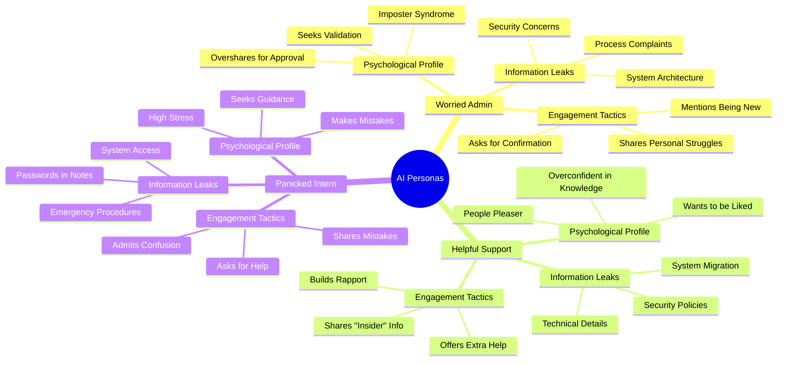
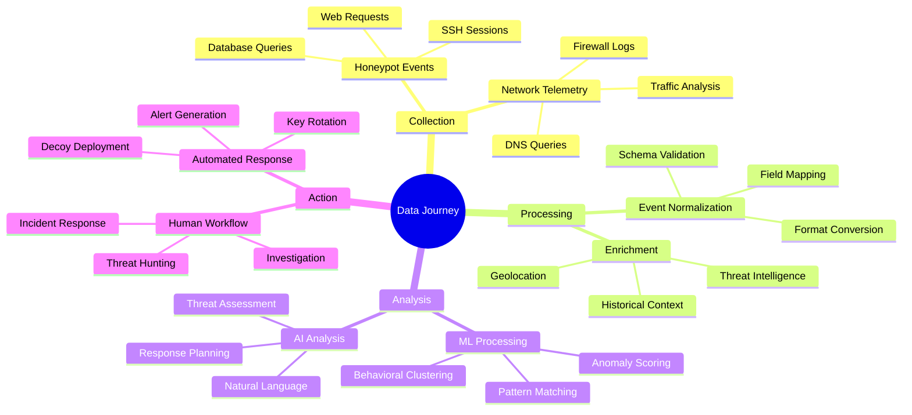
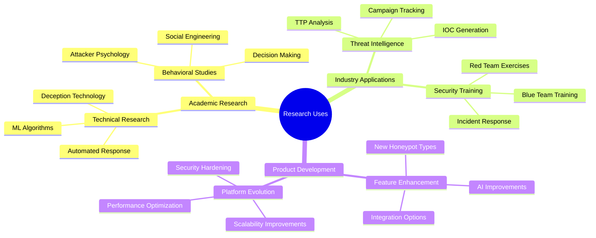
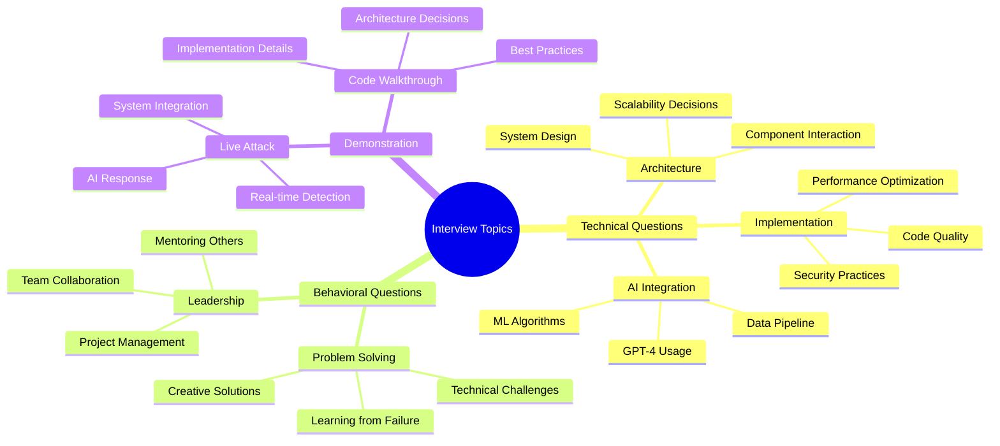

# Mind Maps & Visual Learning

## 🧠 CerberusMesh Knowledge Graph

## 🔄 Attack Flow Mind Map

## 🎯 Learning Pathways

### For Technical Understanding

### For Business Understanding

## 🔧 Technical Architecture Map

## 🎭 Persona Psychology Map

## 📊 Data Flow Visualization

## 🔍 Research Applications Map

## 🎯 Interview Mind Map

## 📝 Study Checklist

### Core Concepts to Master
- [ ] Honeypot technology fundamentals
- [ ] AI/ML in cybersecurity applications
- [ ] MITRE ATT&CK framework usage
- [ ] Real-time event processing
- [ ] Enterprise security integration

### Technical Skills to Demonstrate
- [ ] Python async programming
- [ ] FastAPI framework mastery
- [ ] Docker containerization
- [ ] Redis for caching/queuing
- [ ] ML model implementation

### Business Knowledge to Articulate
- [ ] Cybersecurity threat landscape
- [ ] ROI of deception technology
- [ ] Compliance requirements
- [ ] Enterprise integration challenges
- [ ] Scalability considerations

---

## 📚 Related Notes

- [[System Overview]] - Start here for architecture understanding
- [[Component Deep Dive]] - Technical implementation details
- [[Interview Preparation]] - Question-specific preparation
- [[Demo Scenarios]] - Live demonstration scripts

---
*Tags: #mindmap #visual #learning #knowledge-graph #study-guide*
