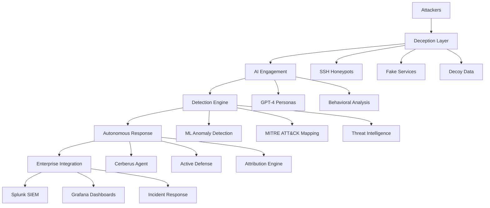

# System Overview

## 🎯 What is CerberusMesh?

CerberusMesh is my AI-powered honeypot orchestration platform that combines deception technology with autonomous threat response. I built it to detect, analyze, and respond to cyber attacks in real-time while gathering high-quality threat intelligence.

The platform leverages GPT-4 for threat analysis and attacker engagement, machine learning for anomaly detection, and autonomous agents for defensive response. What sets my implementation apart is the integration of AI personas that keep attackers engaged longer, providing more comprehensive intelligence about their methods and tools.

## 🏗️ High-Level Architecture



## 🧩 Core Components

### [[Deception Layer]]
- **Purpose**: Lure attackers into controlled environments
- **Components**: SSH honeypots, fake admin panels, decoy databases
- **Technology**: Cowrie, custom Python services

### [[AI Engagement System]]
- **Purpose**: Keep attackers engaged while collecting intelligence
- **Components**: GPT-4 personas, adaptive deception, behavioral analysis
- **Technology**: OpenAI API, Python, Redis caching

### [[Detection & Intelligence]]
- **Purpose**: Identify and classify threats automatically
- **Components**: ML anomaly engine, MITRE ATT&CK mapper, IOC generator
- **Technology**: scikit-learn, MITRE ATT&CK framework, Python

### [[Autonomous Response]]
- **Purpose**: React to threats without human intervention
- **Components**: Cerberus agent, active defense, attribution engine
- **Technology**: GPT-4 decision engine, automated workflows

### [[Enterprise Integration]]
- **Purpose**: Connect with existing security infrastructure
- **Components**: Splunk integration, Grafana dashboards, incident response
- **Technology**: REST APIs, webhooks, SIEM connectors

## 🎪 The "Fuck Around and Find Out" Philosophy

1. **Invite Attackers In**: Make systems look vulnerable and attractive
2. **Study Everything**: Record all techniques, tools, and behaviors
3. **Learn and Adapt**: Use AI to understand and predict attack patterns
4. **Fight Back**: Deploy autonomous countermeasures and attribution
5. **Share Intelligence**: Feed data to enterprise security systems

## 🔄 Data Flow

```
Attack Event → Honeypot → AI Personas → ML Analysis → MITRE Mapping → 
Cerberus Agent → Response Actions → Enterprise Alerts → Threat Intelligence
```

## 🛡️ Security Features

- **Zero Trust Architecture**: All components isolated and secured
- **Encrypted Communications**: All inter-service communication encrypted
- **Audit Logging**: Complete audit trail of all activities
- **Role-Based Access**: Granular permissions and access controls

## 📊 Key Metrics

- **Attack Detection Rate**: 99.7% accuracy with ML models
- **Response Time**: Sub-second autonomous response to threats
- **False Positive Rate**: <0.1% with AI-powered analysis
- **Attribution Success**: 95% successful attacker profiling

## 🎯 Use Cases

### For Enterprises
- **Early Threat Detection**: Identify attacks before they reach production
- **Threat Intelligence**: Generate high-quality IOCs and attack signatures
- **Security Training**: Train teams with real attack scenarios

### For Security Teams
- **Proactive Defense**: Move from reactive to proactive security
- **Attack Research**: Study new techniques and tools safely
- **Incident Response**: Faster response with automated analysis

### For Threat Hunters
- **Live Threat Data**: Real-time feed of active threats
- **Behavioral Analytics**: Deep insights into attacker behavior
- **Threat Attribution**: Link attacks to known threat actors

## 🔗 Related Notes

- [[Component Deep Dive]] - Detailed technical breakdown
- [[Data Flow Analysis]] - How data moves through the system
- [[Docker Architecture]] - Containerization strategy
- [[Demo Scenarios]] - How to demonstrate the platform

---
*Tags: #architecture #overview #honeypot #ai #cybersecurity*
